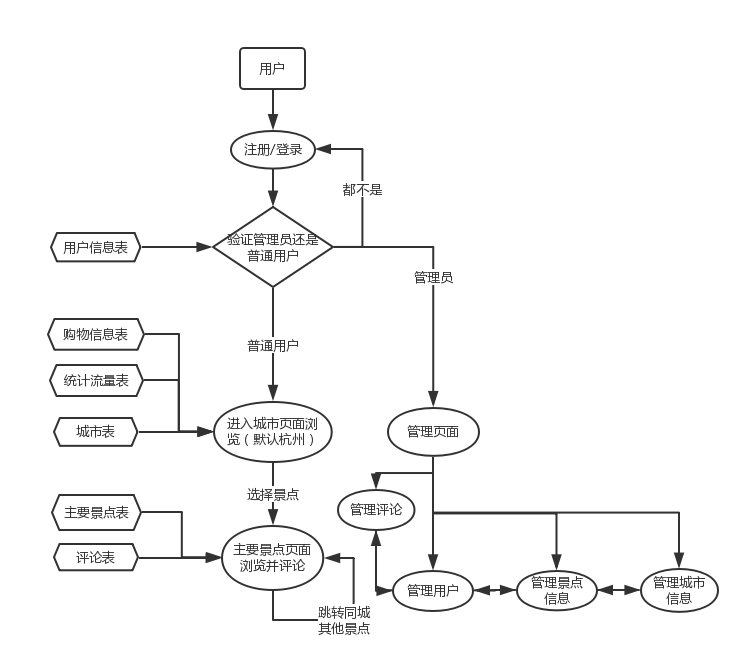
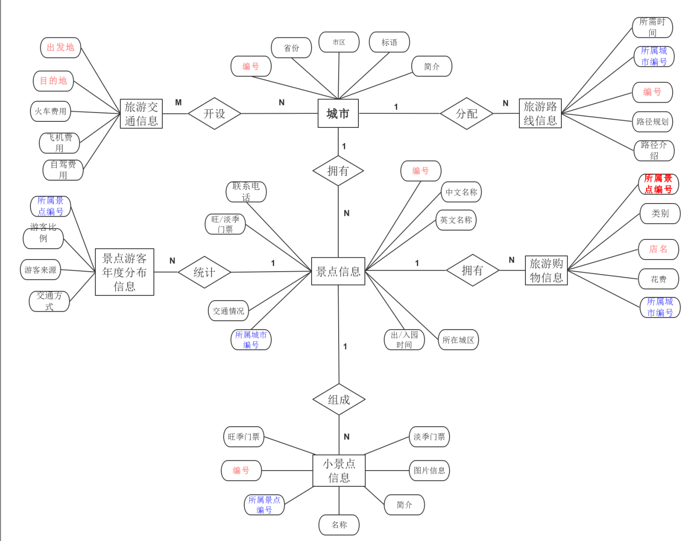
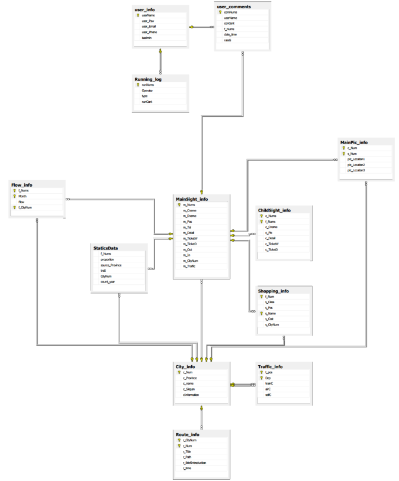
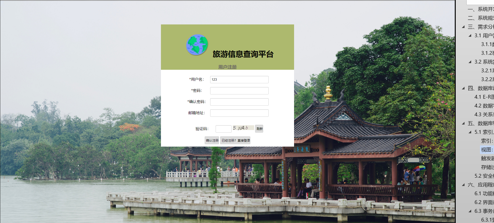
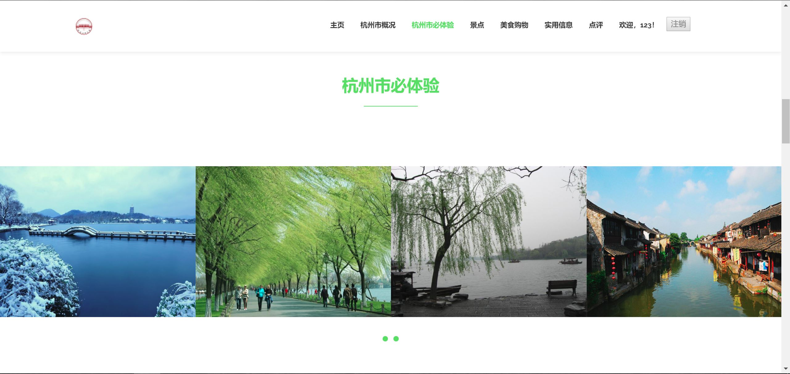
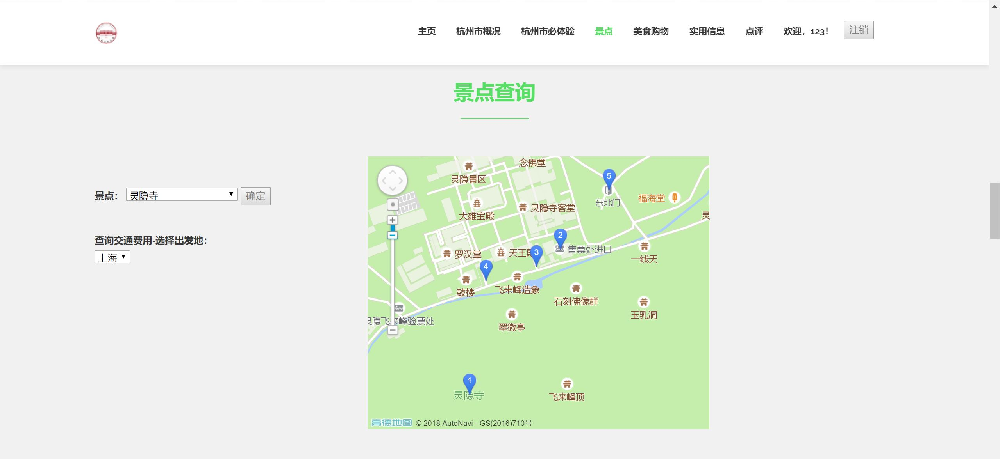
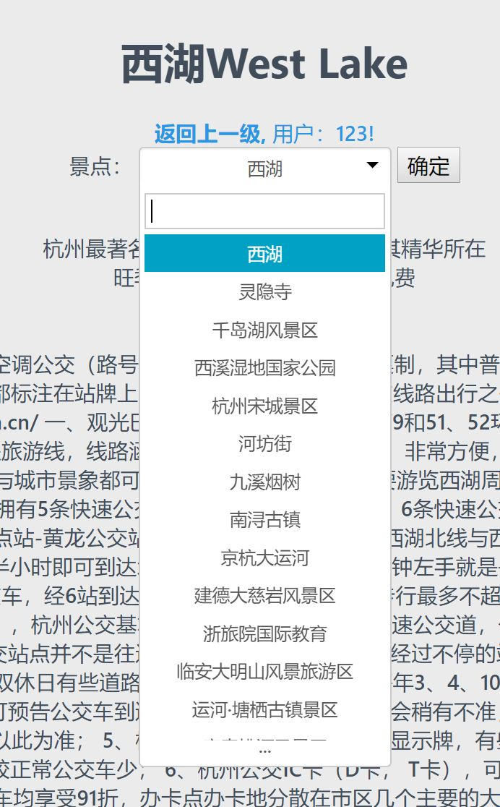

# Tourist information inquiry system

## 系统开发概述
旅游信息查询管理系统是对旅游信息资源进行能够查询并管理的系统。
综合选题中的各项要求：对旅游查询至少需要覆盖“景点信息，景点交通信息，景点介绍，游玩线路，景点游客年度分布信息以及景点费用明细等实体”，本次设计的旅游信息查询系统以杭州市为例出发，提供了一个同时面向大众和普通管理员服务的系统。具体内容包括：城市管理模块，景点资源管理模块，小景点资源管理模块，用户注册登录模块，评论模块，游客分布统计信息模块，交通资源管理模块，旅游购物信息模块以及日志管理模块，并在模块中完成了添加，删除，查询等功能。
本次系统的结构为B/S模式，采用的是Html+CSS+JS（前端）/Java Web（后端）技术，数据库为SQL Server2008，即在传统的网页中插入了基于Java Web的后台程序，使网页根据连接的数据库能够动态化的呈现给用户。系统的特点是，界面友好，操作简单，实用性强，功能完善。

## 业务流程：

## 数据库逻辑设计：
### E-R图：

### 数据库关系图：

## 数据库物理设计：
- 索引：在用户评论表中，为每条评论的日期属性添加了一个索引。由于在评论页面设置了定时动态更新最新十条评论，需要频繁的访问数据库，并且要时刻选日期最靠前的，所以选取日期为索引刚好符合索引的要求：频繁的查询以及查询结果只占全部数据的30%以内。
- 视图：系统中设置了七个视图。
在用户选择进入一级页面时，选中一个城市后，会调用一个存储过程，该存储过程的参数为该城市，然后随即为该城市生成六个对应该城市特定的六个视图数据，以供用户在后续操作中查询。六个视图包括：该城市对应的所有主要景点信息的视图；该城市对应的购物信息的视图；该城市对应的多媒体信息的视图（包括展览图片和城市地图位置坐标）；该城市对应的几条推荐游玩路线的视图；该城市对应的统计信息的视图；该城市对应的所有主要景点的人流量统计信息的视图。这样将某一个特定城市对应的所有信息从数据库庞大的信息中抽离出来，能够大大节省查询的效率和后台运行的负荷延迟。
- 触发器：管理员在后台管理注册的会员时，往往会对一些违规操作的用户进行封号删除处理，这是该用户对应的评论就会受到影响。此时，设立一个触发器：当管理员在删除一个会员，动作执行之前，会触发该触发器，执行动作为，将该用户对应的评论表中的评论用户属性统一修改为“用户已注销”。这样就可以避免不必要的错误。
- 安全机制：用户身份审核验证方面：
前端通过登录密码实现，并且在用户注册后，将其设置的密码转换成MD5加密后的形式存放在数据库，一定程度保证了用户的隐私。
另外，数据库中设置了三种角色：超级管理员，普通管理员以及普通用户。超级管理员可以完成数据库中的所有数据操作，管理，控制等功能，并覆盖了普通管理员和普通用户的权限；普通管理员由超级管理员设置，可以进行一般的管理工作，但不能管理其他平级管理员；而普通用户仅仅可以完成部分必要的查询功能，发表评论功能和注册功能。
- 视图机制：上述创建的视图也一定程度的保证了系统的安全性。将每个视图的权限对应分配给角色对应授权。

## 效果：

